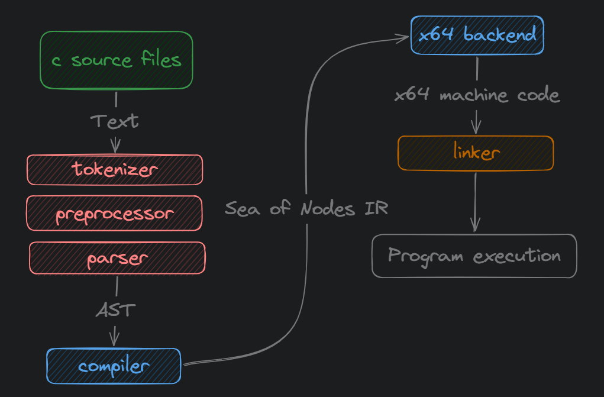
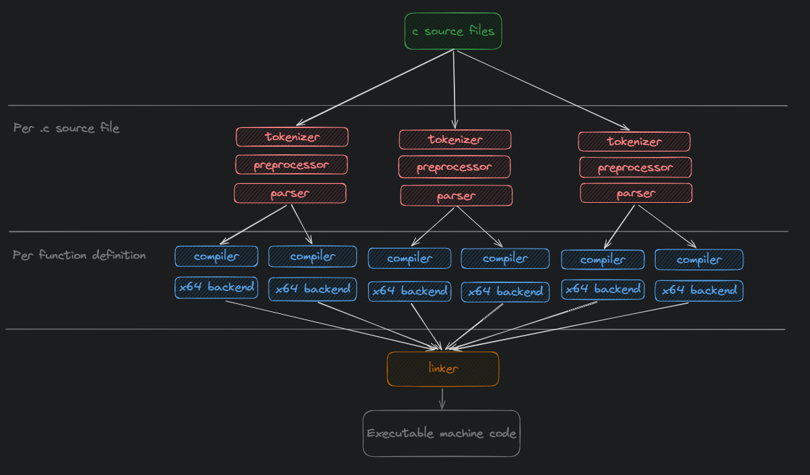
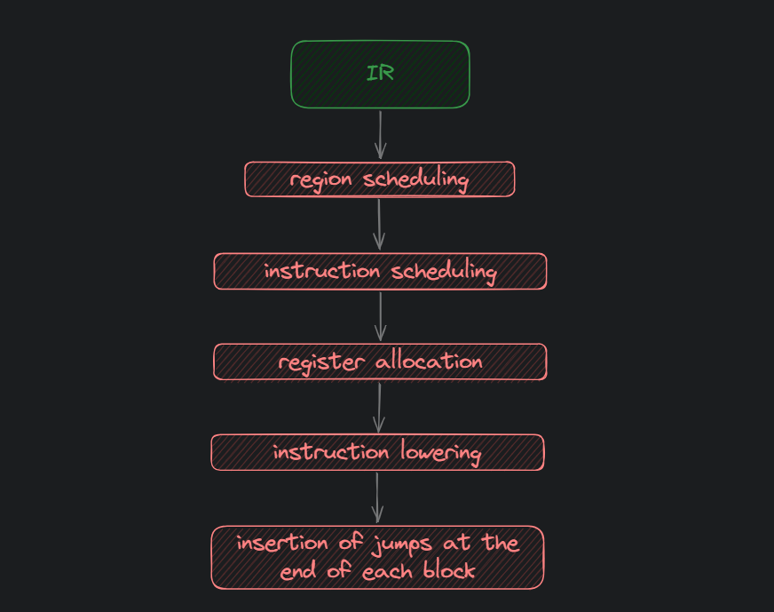

# Architecture

This document describes the high-level architecture of Crankshaft.

## Pipeline overview

The compilation pipeline follows the usual steps you would see any C compiler.

Currently the compiler is single threaded. However, it is built with multithreading in mind: the majority pipeline stages can be trivially mutlithreaded.

For example, parsing of each source file can be done independently.

Both the compiler and x64 backend work on a single function at a time, thus making it possible to paralalize these stages on a per function basis.

---

The above diagram gives a high-level overview of the steps in the pipeline. However, considering that it can be multithreaded, the actual pipeline would look more like this:

## Overview of components

### `driver/src`

The entry point of the compiler. It processes command line arguments and drives the whole compiler pipeline.

### `core/src`

Common code, used by all the compiler components. It includes length-based strings, allocators, memory arenas and OS abstractions.

### `builder/src`

The build system used to build the compiler.

### `parser/src`

Implements a tokenizer, preprocessor, parser and defines the `AST` types.

### `compiler/src`

The actual compiler implementation, that runs on each function definition in the parsed `AST` and outputs the IR.

### `code_gen/src`

Sea of Nodes Intermediate Representation together with related algorithms and data structures (like a dominator tree).

### `code_gen/src/code_gen/backends/x64`

x64 backend implementation, which lowers the IR of one function to x64 machine code.

This is also, where the linker lives.

Backend implementation has multiple stages to it. The IR it receives from the compiler is just a big graph of nodes that only define dependenices between each other. Therefore, the first is to decide upon the order of execution. This is done in `region scheduling` and `instruction scheduling` stages.

The next step involves assigning a limited set of x64 register to instructions. This is done by the `register allocator`.

Once, the instructions are ordered and registers are assigned, the backend can finally lower each instruction to machine code.

The final step, involves computing relative offsets for jumps at the end of each region.

### `gen/src`

A code generator that uses `parser/src` to parse and generate boilerplate code in `code_gen/src`.

### `stdx/src`

Some simplified versions of standard library headers that are sometimes used to work around the limitations of the parser.

### `tester/src`

A test runner and tests written in code.

### `tests/src`

Data-driven tests which don't require recompiling the codebase.

This directory is scanned by the `test_runner`.
